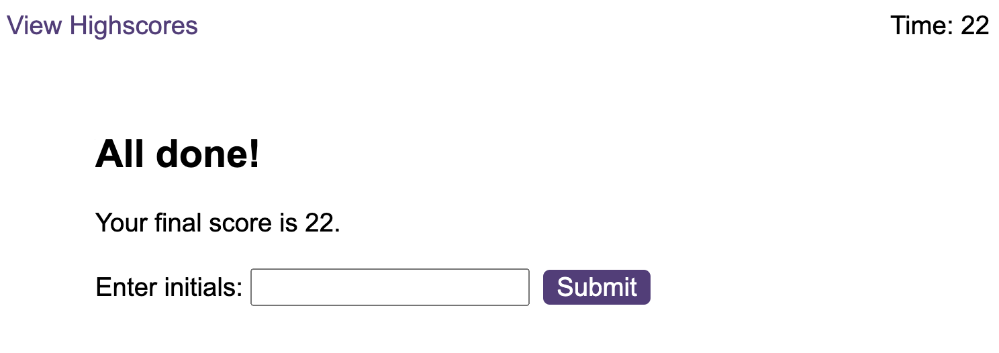
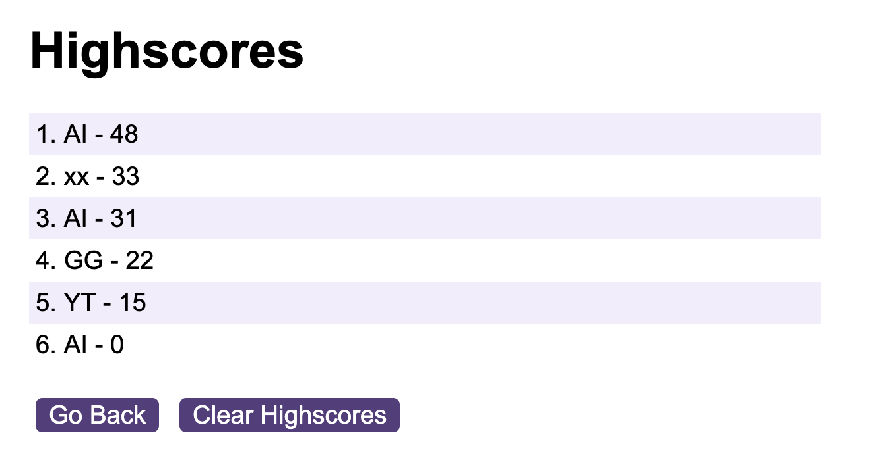

# javascript-quiz

## Descrition

A timed JavaScript quiz with multiple choices and an highscores board

## Usage

The web application is avaialble at https://angeloilardi.github.io/javascript-quiz/

When visiting the page, the user is presented with the rules of the game and option to start the quiz or view the highscores.

When the 'Start Quiz' button is clicked, the countdown starts and the first question pops up. The user has 60 seconds to answer as many questions as possible. 

After selectiong an option, a feedback of *Wrong!* or *Correct!* will appear briefly.

For each wrong answer, the time will go down by 10 seconds.

As soon as the timer reaches 0 or there are no questions left, the game is over and the user is prompted to submit their score.

The final score will be equal to the seconds left or to 0.

The highscores board displays all the previously submitted scores. The highscores list can be reset by clicking 'Clear Highscores'.

Scores are saved in the local storage.

## License

Please refer to the LICENSE in the repo.

